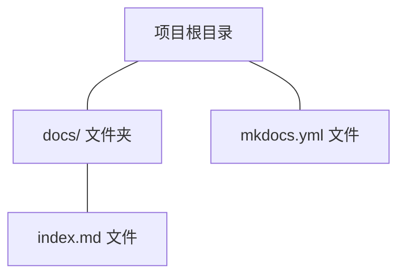

# mkdocs快速搭建帮助文档(以气泡图为例)

## 插件安装

* [Getting started](https://squidfunk.github.io/mkdocs-material/getting-started/)
* [Built-in offline plugin](https://squidfunk.github.io/mkdocs-material/plugins/offline/)

```bash
pip install mkdocs-material

mkdocs new .
```

```bash
.
├─ docs/
│  └─ index.md
└─ mkdocs.yml
```



## 创建文件夹目录

例如`E:\Gitee\helperdoc\BubbleDiagram`

```bash
mkdocs new .
```


Besides, further assets may also be put in the `overrides` directory:

??? note "overrides"

    ```bash
        .
        ├─ .icons/                      # Bundled icon sets
        ├─ assets/
        │  ├─ images/                   # Images and icons
        │  ├─ javascripts/              # JavaScript files
        │  └─ stylesheets/              # Style sheets
        ├─ partials/
        │  ├─ integrations/             # Third-party integrations
        │  │  ├─ analytics/             # Analytics integrations
        │  │  └─ analytics.html         # Analytics setup
        │  ├─ languages/                # Translation languages
        │  ├─ actions.html              # Actions
        │  ├─ alternate.html            # Site language selector
        │  ├─ comments.html             # Comment system (empty by default)
        │  ├─ consent.html              # Consent
        │  ├─ content.html              # Page content
        │  ├─ copyright.html            # Copyright and theme information
        │  ├─ feedback.html             # Was this page helpful?
        │  ├─ footer.html               # Footer bar
        │  ├─ header.html               # Header bar
        │  ├─ icons.html                # Custom icons
        │  ├─ language.html             # Translation setup
        │  ├─ logo.html                 # Logo in header and sidebar
        │  ├─ nav.html                  # Main navigation
        │  ├─ nav-item.html             # Main navigation item
        │  ├─ pagination.html           # Pagination (used for blog)
        │  ├─ palette.html              # Color palette toggle
        │  ├─ post.html                 # Blog post excerpt
        │  ├─ progress.html             # Progress indicator
        │  ├─ search.html               # Search interface
        │  ├─ social.html               # Social links
        │  ├─ source.html               # Repository information
        │  ├─ source-file.html          # Source file information
        │  ├─ tabs.html                 # Tabs navigation
        │  ├─ tabs-item.html            # Tabs navigation item
        │  ├─ tags.html                 # Tags
        │  ├─ toc.html                  # Table of contents
        │  ├─ toc-item.html             # Table of contents item
        │  └─ top.html                  # Back-to-top button
        ├─ 404.html                     # 404 error page
        ├─ base.html                    # Base template
        ├─ blog.html                    # Blog index page
        ├─ blog-archive.html            # Blog archive index page
        ├─ blog-category.html           # Blog category index page
        ├─ blog-post.html               # Blog post page
        └─ main.html                    # Default page
    ```

## 修改`mkdocs.yml`文件

???success

      ```yaml
        site_name: 我的帮助文档
        site_description: 关于mkdocs-material支持的markdown语法，包括传统语法和扩展语法
        site_author: JerryMa
        site_url: http://127.0.0.1:8000
        theme:
          name: material
          palette:
            # Toggle light mode
            - scheme: default
              primary: Blue Grey
              accent: Pink
              toggle:
                icon: material/toggle-switch
                name: 切换到明亮模式
            # Toggle dark mode
            - scheme: slate
              primary: blue
              accent: amber
              toggle:
                icon: material/toggle-switch-off-outline
                name: 切换到暗黑模式
          features:
            - announce.dismiss
            - content.tabs.link
            - content.tooltips
            - content.code.copy #代码复制
            - content.code.select
            - content.code.annotate   
            - content.footnote.tooltips
            - header.autohide
            - navigation.footer
            - navigation.indexes
            - navigation.instant
            - navigation.instant.prefetch
            - navigation.instant.progress
            - navigation.prune
            - navigation.sections
            - navigation.tabs
            - navigation.tabs.sticky
            - navigation.top # 返回顶部的按钮 在上滑时出现  
            - navigation.tracking
            - search.highlight # 搜索出的文章关键词加入高亮
            - search.share #搜索分享按钮   
            - search.suggest # 搜索输入一些字母时推荐补全整个单词
            - toc.follow
            - toc.integrate
          language: 'zh'
        plugins:
          - offline
          - search:
              lang: 
                - zh
                - en
              separator: '[\s\-\.]+'
          - minify:
              minify_html: true
              minify_js: true
              minify_css: true
              htmlmin_opts:
                remove_comments: true
              css_files:
                - stylesheets/extra.css
          - glightbox:
              touchNavigation: true
              loop: false
              effect: zoom
              slide_effect: slide
              width: 100%
              height: auto
              zoomable: true
              draggable: true
              skip_classes:
                - custom-skip-class-name
              auto_caption: false
              caption_position: bottom
        extra:
          social:
            - icon: fontawesome/brands/github #联系方式图标 : https://fontawesome.com/ 去这里找图标
              link: https://github.com/mazaiguo
              name: JerryMa on Github
            - icon: fontawesome/brands/gitlab
              link: https://gitlab.zwsoft.cn/mazaiguo
            - icon: fontawesome/regular/envelope
              link: mailto:mazaiguo@126.com
              name: Email
          analytics:
            feedback:
              title: 这个页面对您有帮助吗？
              ratings:
                - icon: material/emoticon-happy-outline
                  name: 有帮助
                  data: 1
                  note: >-
                    感谢您的反馈！
                - icon: material/emoticon-sad-outline
                  name: 可以改进
                  data: 0
                  note: >-
                    感谢您的反馈！请帮助我们改进这个页面，
                    <a href="https://github.com/mazaiguo/mazaiguo.github.io/issues/new/?title=[Feedback]+{title}+-+{url}" target="_blank" rel="noopener">告诉我们需要改进的地方</a>。
          generator: false #是否删除页脚显示"使用 MkDocs 材料制造"
        extra_javascript:
          - javascripts/katex.js
          - https://unpkg.com/katex@0/dist/katex.min.js
          - https://unpkg.com/katex@0/dist/contrib/auto-render.min.js
          #- https://cdnjs.cloudflare.com/ajax/libs/highlight.js/10.1.1/highlight.min.js
          #- javascripts/config.js
        extra_css:
          #- https://cdnjs.cloudflare.com/ajax/libs/highlight.js/10.1.1/styles/default.min.css
          - stylesheets/extra.css  
          - https://unpkg.com/katex@0/dist/katex.min.css
        markdown_extensions:
          - abbr
          - admonition
          - attr_list
          - def_list
          - footnotes
          - md_in_html
          - meta
          - tables
          - toc:
              permalink: true
              title: 目录
          - pymdownx.arithmatex:
              generic: true
          - pymdownx.betterem:
              smart_enable: all
          - pymdownx.caret
          - pymdownx.details
          - pymdownx.emoji:
              emoji_generator: !!python/name:material.extensions.emoji.to_svg
              emoji_index: !!python/name:material.extensions.emoji.twemoji
          - pymdownx.highlight:
              anchor_linenums: true
              line_spans: __span
              pygments_lang_class: true
              linenums: true
              linenums_style: pymdownx.inline
              auto_title: true # 显示编程语言名称
              use_pygments: true
          - pymdownx.inlinehilite
          - pymdownx.keys
          - pymdownx.magiclink:
              normalize_issue_symbols: true
              repo_url_shorthand: true
              user: mazaiguo
              repo: helpdoc
          - pymdownx.mark
          - pymdownx.smartsymbols
          - pymdownx.snippets:
              check_paths: true
          - pymdownx.superfences:
              custom_fences:
                - name: mermaid
                  class: mermaid
                  format: !!python/name:pymdownx.superfences.fence_code_format
          - pymdownx.tabbed:
              alternate_style: true
              combine_header_slug: true
              slugify: !!python/object/apply:pymdownx.slugs.slugify
                kwds:
                  case: lower
          - pymdownx.tasklist:
              custom_checkbox: true
          - pymdownx.tilde
          - pymdownx.critic
        copyright: Copyright &copy; 2016 - present JerryMa
      ```


这几个是MKDOCS内置使用的，我们建立文件夹时不要与这些名字冲突了

## 增加一些配置文件

[`katex-docsjavascriptskatexjs`](https://squidfunk.github.io/mkdocs-material/reference/math/)

???note 

     ```javascript
        document$.subscribe(({ body }) => { 
          renderMathInElement(body, {
            delimiters: [
              { left: "$$",  right: "$$",  display: true },
              { left: "$",   right: "$",   display: false },
              { left: "\\(", right: "\\)", display: false },
              { left: "\\[", right: "\\]", display: true }
            ],
          })
        })
     ```

[`docs/javascripts/tablesort.js`](https://squidfunk.github.io/mkdocs-material/reference/data-tables/)

???note

    ```javascript
    document$.subscribe(function() {
      var tables = document.querySelectorAll("article table:not([class])")
      tables.forEach(function(table) {
        new Tablesort(table)
      })
    })
    ```

[`docs\stylesheets\extra.css`]

???warning

    ```css
        :root > * {
          --md-code-hl-string-color: #0ff1ce;
          --md-code-hl-number-color: #ae81ff;
          --md-code-hl-special-color: #a846b9;
          --md-code-hl-function-color: #66d9ef;
          --md-code-hl-constant-color: #f92672;
          --md-code-hl-keyword-color: #f92672;
          --md-code-hl-string-color: #e6db74;
          --md-code-hl-name-color: #feffff;
          --md-code-hl-operator-color: #f92672;
          --md-code-hl-punctuation-color: #ffffff;
          --md-code-hl-comment-color: #757575;
          --md-code-hl-generic-color: #af82fc;
          --md-code-hl-variable-color: #f92672;
          --md-code-fg-color: #ffffff;
          --md-code-bg-color: #282c34;
          --md-code-hl-color: #ffff7f;
          --md-default-fg-color--light: #75715f;
        }
        .md-typeset p > code {
          background-color: #ffffff;
          color: #eb245c;
        }
        .md-typeset li code {
          background-color: #ffffff;
          color: #eb245c;
        }
        /*代码块头部图标 start*/
        .highlight span.filename pre:before {
          content: "";
          display: block;
          background: url(../assets/images/codeHeader.png);
          height: 30px;
          background-size: 40px;
          background-repeat: no-repeat;
          background-color: #212121;
          background-position: 10px 10px;
        }
        /*代码块头部图标 end*/
    
        .highlighttable .code pre > code {
          color: #c0c3c1;
          font-family: "Inconsolata", consolas, "PingFang SC", "Microsoft YaHei",
            monospace;
          background-color: #212121;
          font-size: 15px;
          white-space: pre;
          line-height: 1.5;
          -moz-tab-size: 4;
          -o-tab-size: 4;
          tab-size: 4;
        }
        .highlight span.filename {
          color: white;
        }
    
        /* 基础容器样式：确保导航项布局正常 */
        .md-nav__list {
          list-style: none;
          padding: 0;
          margin: 0;
          width: 280px; /* 适配侧边导航宽度，可按需调整 */
        }
        .md-nav__item {
          margin: 4px 0;
        }
        .md-nav__link {
          display: block;
          padding: 8px 12px;
          border-radius: 6px;
          text-decoration: none;
          color: #333; /* 默认文本色 */
          transition: all 0.3s ease; /* 统一过渡动画，确保流畅性 */
        }
    
        /* 核心：.md-ellipsis 交互特效 */
        .md-ellipsis {
          position: relative;
          z-index: 1;
          transition: color 0.3s ease;
        }
        /* 鼠标悬浮（hover）效果：文本变色 + 底部渐变下划线 */
        .md-nav__link:hover .md-ellipsis {
          color: #165dff; /* 悬浮文本主色（可替换为品牌色） */
        }
        .md-nav__link:hover .md-ellipsis::after {
          content: "";
          position: absolute;
          left: 0;
          bottom: -2px;
          width: 100%;
          height: 2px;
          background: linear-gradient(90deg, #165dff, #4080ff); /* 渐变下划线 */
          border-radius: 1px;
          transform: scaleX(1);
          transform-origin: left center;
          transition: transform 0.3s ease;
        }
        /* 初始状态：下划线收缩至0，hover时展开 */
        .md-ellipsis::after {
          content: "";
          position: absolute;
          left: 0;
          bottom: -2px;
          width: 100%;
          height: 2px;
          background: linear-gradient(90deg, #165dff, #4080ff);
          border-radius: 1px;
          transform: scaleX(0);
          transform-origin: left center;
          transition: transform 0.3s ease;
        }
    
        /* 鼠标点击（active）效果：文本加深 + 背景压暗 */
        .md-nav__link:active .md-ellipsis {
          color: #0e42d2; /* 点击文本加深色 */
          font-weight: 500; /* 点击时文本轻微加粗 */
        }
        .md-nav__link:active {
          background-color: rgba(22, 93, 255, 0.1); /* 点击背景色（淡蓝压暗） */
          transform: translateY(1px); /* 轻微下沉，模拟物理按压感 */
          transition: transform 0.1s ease, background-color 0.1s ease;
        }
    
        /* 激活状态（.md-nav__link--active）：区分当前选中项 */
        .md-nav__link--active .md-ellipsis {
          color: #165dff;
          font-weight: 500;
        }
        .md-nav__link--active .md-ellipsis::after {
          transform: scaleX(1); /* 激活项默认显示下划线 */
        }
        .md-nav__link--active {
          background-color: rgba(22, 93, 255, 0.05); /* 激活项背景色 */
        }
    
        /* 标签云样式 */
        .tag-cloud {
          margin: 1rem 0;
          line-height: 2;
        }
    
        .tag-cloud .tag {
          display: inline-block;
          padding: 0.25rem 0.5rem;
          margin: 0.125rem;
          background-color: var(--md-primary-fg-color--light);
          color: var(--md-primary-bg-color);
          border-radius: 0.25rem;
          text-decoration: none;
          font-size: 0.875rem;
          font-weight: 500;
          transition: all 0.2s ease;
        }
    
        .tag-cloud .tag:hover {
          background-color: var(--md-primary-fg-color);
          transform: translateY(-1px);
          box-shadow: 0 2px 4px rgba(0, 0, 0, 0.1);
        }
    
        /* 暗色主题下的标签样式 */
        [data-md-color-scheme="slate"] .tag-cloud .tag {
          background-color: var(--md-accent-fg-color);
          color: var(--md-default-bg-color);
        }
    
        [data-md-color-scheme="slate"] .tag-cloud .tag:hover {
          background-color: var(--md-accent-fg-color--transparent);
        }
    
        /* 博客卡片样式 */
        .blog-card {
          background: var(--md-default-bg-color);
          border: 1px solid var(--md-default-fg-color--lightest);
          border-radius: 0.5rem;
          padding: 1.5rem;
          margin: 1rem 0;
          transition: all 0.2s ease;
        }
    
        .blog-card:hover {
          box-shadow: 0 4px 8px rgba(0, 0, 0, 0.1);
          transform: translateY(-2px);
        }
    
        /* 统计数字样式 */
        .stats-grid {
          display: grid;
          grid-template-columns: repeat(auto-fit, minmax(200px, 1fr));
          gap: 1rem;
          margin: 2rem 0;
        }
    
        .stat-item {
          text-align: center;
          padding: 1rem;
          background: var(--md-default-bg-color);
          border: 1px solid var(--md-default-fg-color--lightest);
          border-radius: 0.5rem;
        }
    
        .stat-number {
          font-size: 2rem;
          font-weight: bold;
          color: var(--md-primary-fg-color);
          display: block;
        }
    
        .stat-label {
          font-size: 0.875rem;
          color: var(--md-default-fg-color--light);
          margin-top: 0.5rem;
        }
    
        /* 分类页面样式 */
        .category-section {
          margin: 2rem 0;
        }
    
        .category-title {
          color: var(--md-primary-fg-color);
          border-bottom: 2px solid var(--md-primary-fg-color--light);
          padding-bottom: 0.5rem;
          margin-bottom: 1rem;
        }
    
        .category-list {
          list-style: none;
          padding: 0;
        }
    
        .category-list li {
          margin: 0.5rem 0;
          padding-left: 1rem;
          border-left: 3px solid var(--md-accent-fg-color);
        }
    
        .category-list a {
          text-decoration: none;
          color: var(--md-default-fg-color);
          font-weight: 500;
        }
    
        .category-list a:hover {
          color: var(--md-primary-fg-color);
        }
    
        /* 响应式设计 */
        @media screen and (max-width: 768px) {
          .tag-cloud .tag {
            font-size: 0.75rem;
            padding: 0.2rem 0.4rem;
          }
    
          .stats-grid {
            grid-template-columns: repeat(auto-fit, minmax(150px, 1fr));
          }
    
          .stat-number {
            font-size: 1.5rem;
          }
        }
    
        /* 代码块优化 */
        .highlight pre {
          border-radius: 0.5rem;
          box-shadow: 0 2px 4px rgba(0, 0, 0, 0.1);
        }
    
        /* 文章元信息样式 */
        .article-meta {
          display: flex;
          flex-wrap: wrap;
          gap: 1rem;
          margin: 1rem 0;
          padding: 1rem;
          background: var(--md-code-bg-color);
          border-radius: 0.5rem;
          font-size: 0.875rem;
          color: var(--md-default-fg-color--light);
        }
    
        .article-meta .meta-item {
          display: flex;
          align-items: center;
          gap: 0.25rem;
        }
    
        .article-meta .meta-icon {
          width: 1rem;
          height: 1rem;
          opacity: 0.7;
        }
    
        /* 博客文章列表样式优化 */
        .md-content .md-typeset .md-post {
          margin-bottom: 2rem;
          padding-bottom: 2rem;
          border-bottom: 1px solid var(--md-default-fg-color--lightest);
        }
    
        .md-content .md-typeset .md-post:last-child {
          border-bottom: none;
        }
    
        /* 提高阅读体验 */
        .md-typeset h1,
        .md-typeset h2,
        .md-typeset h3 {
          margin-top: 2rem;
          margin-bottom: 1rem;
        }
    
        .md-typeset h1:first-child,
        .md-typeset h2:first-child,
        .md-typeset h3:first-child {
          margin-top: 0;
        }
    ```

[`docs\assets\images\codeHeader.png`]


## 帮助文档生成样式


## [mkdocs_help_doc](https://gitee.com/mazaiguo/mkdocs_help_doc.git)